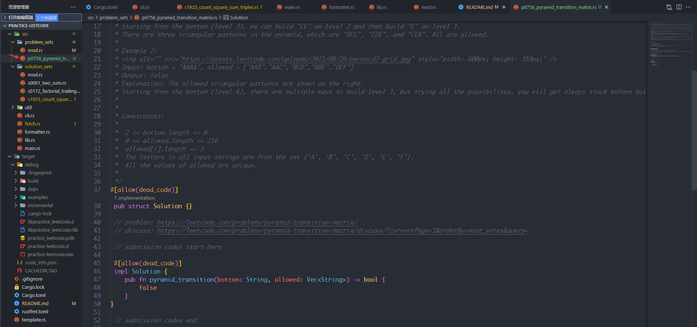

# LeetCode.rs
Download leetcode problem to local and generate the appropriate rust file. You can code directly locally and enjoy code completion.

Download problems which contains questions, samples, descriptions, and code templete in the problem_sets folder

When solved a problem, you can solve $id. The problem will move to the solution_sets folder, and README.md will add the problem automatically.


## TDD
Create tests by test-case, you can enjoy TDD in local


## usage
```shell
cargo run -- -h, --help          Print help information
cargo run -- -i, --id <id>       generate problem by a frontend problem <id>
cargo run -- -r, --random        generate a random problem
cargo run -- -s, --solve <id>    solve the problem's <id>
cargo run test <test_id>         test algorithm
```

## Resolved
<table id="leetcode" class="table-auto">
  <thead>
    <tr>
      <th>id</th>
      <th>Leetcode</th>
      <th>Level</th>
    </tr>
  </thead>
  <tbody>
   <tr>
        <td>0001</td>
        <td><a href="./src/solution_sets/s0001_two_sum.rs"> two-sum</a></td>
        <td>Easy</td>
    </tr>
   <tr>
        <td>0172</td>
        <td><a href="./src/solution_sets/s0172_factorial_trailing_zeroes.rs"> factorial-trailing-zeroes</a></td>
        <td>Medium</td>
    </tr>
   <tr>
        <td>1925</td>
        <td><a href="./src/solution_sets/s1925_count_square_sum_triples.rs"> count-square-sum-triples</a></td>
        <td>Easy</td>
    </tr>
   <tr>
        <td>0283</td>
        <td><a href="./src/solution_sets/s0283_move_zeroes.rs"> move-zeroes</a></td>
        <td>Easy</td>
    </tr>
   <tr>
        <td>0027</td>
        <td><a href="./src/solution_sets/s0027_remove_element.rs"> remove-element</a></td>
        <td>Easy</td>
    </tr>
   <tr>
        <td>0026</td>
        <td><a href="./src/solution_sets/s0026_remove_duplicates_from_sorted_array.rs"> remove-duplicates-from-sorted-array</a></td>
        <td>Easy</td>
    </tr>
   <tr>
        <td>0080</td>
        <td><a href="./src/solution_sets/s0080_remove_duplicates_from_sorted_array_ii.rs"> remove-duplicates-from-sorted-array-ii</a></td>
        <td>Medium</td>
    </tr>
   <tr>
        <td>0075</td>
        <td><a href="./src/solution_sets/s0075_sort_colors.rs"> sort-colors</a></td>
        <td>Medium</td>
    </tr>
   <tr>
        <td>0215</td>
        <td><a href="./src/solution_sets/s0215_kth_largest_element_in_an_array.rs"> kth-largest-element-in-an-array</a></td>
        <td>Medium</td>
    </tr>
   <tr>
        <td>0088</td>
        <td><a href="./src/solution_sets/s0088_merge_sorted_array.rs"> merge-sorted-array</a></td>
        <td>Easy</td>
    </tr>
   <tr>
        <td>0167</td>
        <td><a href="./src/solution_sets/s0167_two_sum_ii_input_array_is_sorted.rs"> two-sum-ii-input-array-is-sorted</a></td>
        <td>Medium</td>
    </tr>
   <tr>
        <td>0011</td>
        <td><a href="./src/solution_sets/s0011_container_with_most_water.rs"> container-with-most-water</a></td>
        <td>Medium</td>
    </tr>
   <tr>
        <td>0209</td>
        <td><a href="./src/solution_sets/s0209_minimum_size_subarray_sum.rs"> minimum-size-subarray-sum</a></td>
        <td>Medium</td>
    </tr>
   <tr>
        <td>0232</td>
        <td><a href="./src/solution_sets/s0232_implement_queue_using_stacks.rs"> implement-queue-using-stacks</a></td>
        <td>Easy</td>
    </tr>
   <tr>
        <td>0206</td>
        <td><a href="./src/solution_sets/s0206_reverse_linked_list.rs"> reverse-linked-list</a></td>
        <td>Easy</td>
    </tr>
